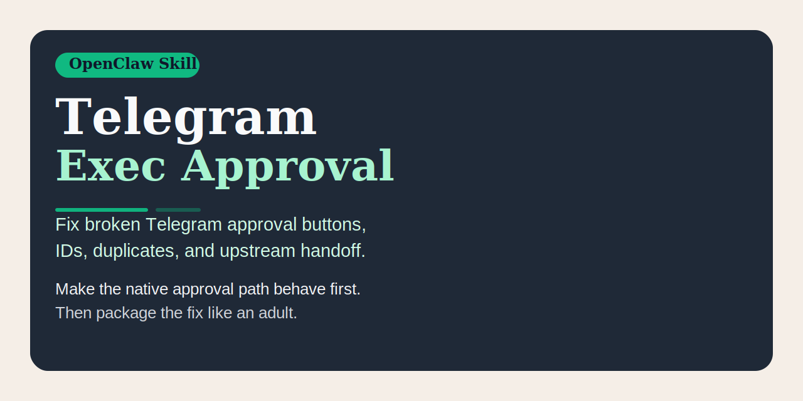

# Telegram Exec Approval




Reusable skill for fixing Telegram interactive exec approvals without turning the debugging process into folklore.

## Quick pitch

Fix broken Telegram approval buttons, IDs, duplicates, and upstream handoff.
Make the native approval path behave first. Then package the fix like an adult.

## Why this exists

Telegram approval UX fails in a few especially annoying ways:

- approval messages show the wrong ID
- buttons are missing or point at the wrong approval target
- duplicate approval messages appear after restart
- local validation works, but the fix never gets packaged cleanly for reuse or upstream review

That combination is how teams end up with tribal knowledge instead of a reproducible fix.

`telegram-exec-approval` exists to stop that nonsense.

It packages a focused workflow for:

- separating the visible approval surfaces
- validating the Telegram-native approval path end-to-end
- fixing wrong IDs and missing or misleading button behavior
- deduping noisy approval messages
- turning the local fix into a reusable or upstreamable change

## Works independently

`telegram-exec-approval` stands on its own.

Use it even if you do not adopt any broader Telegram debugging or continuity skill. On its own, it already improves:

- approval ID correctness
- inline button routing
- duplicate approval suppression
- Telegram-native validation discipline
- reusable packaging and upstream handoff

Related repos may help nearby problems, but they are not required for this repo to be useful.

## What the skill teaches

The skill tells the agent to:

- separate the approval surfaces before patching anything
- treat the full `approvalId` as authoritative rather than trusting display-only IDs
- make the native Telegram approval path work end-to-end first
- patch the smallest wrong user-visible surface before widening the fix
- dedupe repeated approval handling for a short window when duplicate messages appear
- keep the Telegram button message minimal if another message already carries the detailed body
- collapse a local runtime fix into the smallest reusable or upstream-ready change

## When to use it

Use `telegram-exec-approval` when Telegram needs any of the following:

- diagnose broken exec approval flows
- repair button-driven approval routing
- distinguish full `approvalId` from short display-only IDs
- suppress duplicate native approval messages after restart
- prepare a cleaner upstream patch or PR for the Telegram approval flow

## Example behavior

### Example 1: wrong visible ID

A Telegram approval message shows a short ID, while `/approve` only works with a longer internal ID.

A good agent should:

1. verify which surface is showing the wrong identifier
2. treat the full `approvalId` as the authoritative value
3. patch the smallest visible surface that still leaks the wrong ID
4. retest with a fresh approval request

### Example 2: buttons exist but route badly

A button message appears in Telegram, but tapping it does not resolve the correct approval.

A good agent should:

1. prove ordinary Telegram inline buttons work at all
2. log and compare the exact emitted `approvalId`
3. verify the button and the assistant-facing pending reply refer to the same full ID
4. fix the Telegram handler before touching broader surfaces

### Example 3: local fix works, upstream plan is messy

A local runtime patch solves the problem, but the source-level change is still unclear.

A good agent should:

1. strip temporary debugging junk
2. collapse the working fix into the smallest coherent change
3. use the bundled references for PR framing and upstream mapping
4. package the result so the fix is reusable outside one machine

## Related skills

These are related, not required:

- `restart-continuity`: useful when approval UX bugs get tangled with restart behavior — <https://github.com/ruanrrn/restart-continuity>
- `multi-task-continuity`: useful when approval repair happens inside a longer multitask workflow — <https://github.com/ruanrrn/multi-task-continuity>

If Telegram exec approval UX is the main pain, use this repo alone.

## Social preview

Suggested social preview asset: `assets/social-preview.svg`

Suggested one-line copy:

> Fix broken Telegram approval buttons, IDs, duplicates, and upstream handoff.

GitHub note:

- The current `gh` CLI and GraphQL `UpdateRepositoryInput` do not expose a writable custom social preview field.
- To use this image as the repository social preview, upload `assets/social-preview.svg` manually in the repo settings UI.

## What you get

- `telegram-exec-approval-ui/` - the skill source
- `telegram-exec-approval-ui/references/upstream-plan.md` - how to translate local runtime patching into a source-level fix
- `telegram-exec-approval-ui/references/pr-draft.md` - PR framing and validation notes
- `dist/telegram-exec-approval-ui.skill` - packaged artifact ready to install or share

## Install

Use either path:

1. Import `dist/telegram-exec-approval-ui.skill` into an OpenClaw environment.
2. Copy `telegram-exec-approval-ui/` into your skills directory if you want the editable source.

## Repository layout

```text
telegram-exec-approval/
├── LICENSE
├── README.md
├── CONTRIBUTING.md
├── assets/
│   └── social-preview.svg
├── telegram-exec-approval-ui/
│   ├── SKILL.md
│   └── references/
│       ├── pr-draft.md
│       └── upstream-plan.md
└── dist/
    └── telegram-exec-approval-ui.skill
```

## Contributing

See `CONTRIBUTING.md` for contribution scope, PR expectations, and how to keep this repo focused on Telegram exec approvals instead of turning it into a generic Telegram junk drawer.

## Release hygiene

- Keep the repository description aligned with the skill trigger language
- Regenerate `dist/telegram-exec-approval-ui.skill` after each material skill change
- Keep the repo narrow and practical; no unrelated debug junk
- Keep the reusable and upstream-facing guidance aligned with the actual fix path

## Repository

- GitHub: `https://github.com/ruanrrn/telegram-exec-approval`
- License: MIT
